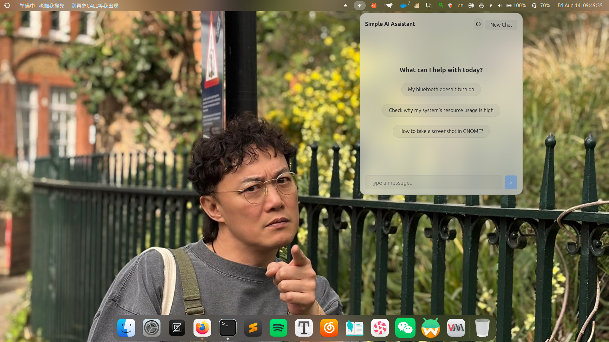

# Simple AI Assistant

A light-weight, private agentic AI assistant for GNOME Shell. Get things done with terminal command support and local system context.

**Source Code**:  [GitHub](https://github.com/0xHertz/gnome-simple-ai-assistant)

Inspired By: [GIthub](https://github.com/MomenAbdelwadoud/linux-simple-ai-assistant)

## 🌟 Features

- **Multi-Provider Support**: OpenAI, Google Gemini, Anthropic Claude, DeepSeek, or any OpenAI-compatible endpoint.
- **Markdown Rendering**: Headers, bold/italic, inline code, fenced code blocks, tables, links, lists, and blockquotes.
- **Selectable & Copyable Messages**: Copy any response with one click, or select text directly with the mouse.
- **Agentic Loop**: AI can propose commands, see output, and continue the task.
- **Sudo Support**: Execute privileged commands safely via `pkexec` with native system password prompts and output capture.
- **System Awareness**: Optionally share system details (CPU, GPU, RAM, OS) for better technical assistance.
- **Secure & Private**: API keys are stored locally in GSettings. No data is sent to anyone but your chosen AI provider.
- **Theme Support**: Automatically matches your system theme (Light/Dark).
- **Keyboard Shortcut**: Configurable global shortcut to open the assistant.
- **Customizable Window**: Adjustable width and height.
- **History Management**: Local history storage with configurable message limits.

## 📸 Screenshots



## 🛠 Prerequisites

- GNOME Shell 45+
- API Key for OpenAI, Google Gemini, Anthropic Claude, DeepSeek, or any OpenAI-compatible endpoint

## 🚀 Installation

1. Clone or download this repository.
2. Copy the folder to your local extensions directory:
    ```bash
    cp -r . ~/.local/share/gnome-shell/extensions/simple-ai-assistant@momen.codes
    ```
3. Compile the settings schema:
    ```bash
    glib-compile-schemas ~/.local/share/gnome-shell/extensions/simple-ai-assistant@momen.codes/schemas/
    ```
4. Restart GNOME Shell (Alt+F2 + `r` on X11, or Log out/Log in on Wayland).
5. Enable the extension using GNOME Extensions app.

## 📝 Privacy Notes

- **API Keys**: Stored locally in your system's GSettings (dconf).
- **Sudo Commands**: Privileged commands use `pkexec`, ensuring the extension never sees your password while still capturing command output correctly.
- **Data**: All data stays on your machine. Chat history is stored locally in `~/.cache/simple-ai-assistant/`.
- **Telemetry**: No tracking or analytics code is included.

## 👨‍💻 Credits

Developed by **0xHertz** .

## 📜 License

This project is licensed under the [GNU General Public License v3.0](LICENSE).
